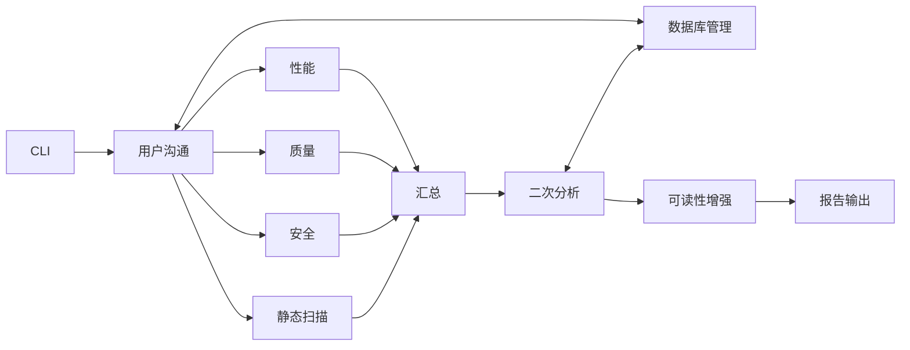

# MAS (Multi-Agent System)

MAS 是基于多智能体的 AI 代码审查与知识管理系统。用户通过自然语言发起分析或知识库操作；系统并行执行静态扫描与质量 / 安全 / 性能分析，经汇总后进入二次深度分析（知识库纠错与补漏），最终输出可读 Markdown 报告。

---

## 核心能力

- **自然语言交互**：意图识别（`code` / `db` / `unknown`），生成结构化 `TASK_PLAN` JSON；危险 DB 操作需二次确认。
- **多维度分析**：静态工具扫描 + AI 质量 / 安全 / 性能并行分析。
- **知识增强二次分析**：基于 SQLite + Weaviate 纠正误判、按源码分片检索补漏。
- **对照实验输出**：同一次 run 可产出 `pureLLM` / `fullLayer` / 多层融合（`second_pass`）及对应可读化报告。
- **知识沉淀**：`AIDrivenDatabaseManageAgent` 写入 SQLite 事实库，并同步 Weaviate 向量索引。

---

## 快速开始

### 环境

- Python 3.12+
- PyTorch 2.8.0+、Transformers 4.56.0+（见 `requirements.txt`）
- 建议 8GB+ 内存；运行对话模型时推荐 16GB+
- Weaviate（可选，用于语义检索）：`weaviate-client >= 3.26.0`；镜像参考 `requirements.txt` 注释

### 安装

```bash
git clone <repository-url>
cd MAS
python -m venv venv
# Linux/Mac
source venv/bin/activate
# Windows
venv\Scripts\activate
pip install -r requirements.txt
```

### 常用命令

```bash
# 交互对话
python mas.py login

# 启动并指定分析目录
python mas.py login --target-dir /path/to/code

# 强制 CPU 模式
python mas.py login --cpu

# 仅验证任务规划、不跑真实分析
MAS_MOCK_CODE_ANALYSIS=1 python mas.py login
```

入口：`mas.py` → `api/main.py`（当前仅 `login` 命令）。

---

## Agent 体系

| 层级 | Agent | 职责 |
|------|-------|------|
| 用户交互 | `UserCommunicationAgent` | 对话、意图识别、任务分派 |
| 分析执行 | `StaticCodeScanAgent` | pylint / flake8 / bandit / radon / cppcheck / semgrep 等 |
| | `AIDrivenCodeQualityAgent` | 规范、可维护性、设计问题 |
| | `AIDrivenSecurityAgent` | 漏洞、威胁建模、敏感信息 |
| | `AIDrivenPerformanceAgent` | I/O / 循环 / 内存等性能信号（忽略纯注释误报） |
| | `AIDrivenSecondPassAnalysisAgent` | 知识库纠错 + 源码分片补漏 |
| | `AIDrivenReadabilityEnhancementAgent` | JSON → Markdown，附 `vectorDebug.json` |
| 数据管理 | `AIDrivenDatabaseManageAgent` | SQLite CRUD、Weaviate 同步 |
| 结果汇总 | `SummaryAgent` | 收齐四路分析后生成 `consolidated_*.json`，转发二次分析 |

### 主流程



1. 用户沟通 Agent 解析意图，派发 `code_analysis_tasks` 或 `db_tasks`。
2. 四路分析完成后，Summary Agent 写 `consolidated/`，并转发二次分析。
3. 二次分析两轮对照：`fullLayer`（仅 full 向量层）与多层融合（默认）；再转发可读性增强。
4. 最终以 `readability_enhancement/` 下 Markdown 为准查看结果。

---

## 二次深度分析（当前行为）

二次分析在可读性增强之前执行，共享证据收集，再顺序跑两条通道：

1. **误判纠正**：对已识别问题检索历史知识，修正 severity / source / 描述；证据不足则 `no_change`。
2. **漏报补充**：将源码按字符预算分片（`gap_code_chunk_chars` / `gap_chunk_overlap_lines` / `max_gap_code_chunks`），用分片查询 Weaviate/SQLite，发现一轮漏报。

检索与打分要点：

- Weaviate 四层：`semantic` / `code_pattern` / `solution` / `full`；查询时按 `vector_layer` 过滤。
- `layer_bonus`（默认 semantic +0.08、solution +0.05、code_pattern +0.03、full +0.01），仅在 `semantic_score >= similarity_threshold` 时发放。
- 门限决策：`formal_hit` / `explanatory_hit` 可采纳；`discarded_hit` / `low_confidence_hit` 不作为修正或补漏依据。
- Prompt 明确：优先稀疏层高分命中；`weaviate_full_match` 不宜单独主导结论。

对照轮次（同一 run）：

| 轮次 | 输出目录 | 含义 |
|------|----------|------|
| pureLLM | `pureLLM/consolidated/` | 未走知识库增强的基线副本 |
| r1 | `fullLayer/consolidated/` | 仅 full 层检索 |
| r2 | `second_pass/consolidated/` | 多层融合（默认正式结果） |

配置见 `infrastructure/config/ai_agent_config.json` → `second_pass_analysis`。

---

## 报告目录

```text
reports/analysis/{run_id}/
├── agents/                         # 各 Agent 原始 JSON
├── consolidated/                   # 一轮汇总 JSON
├── pureLLM/consolidated/           # 纯 LLM 对照
├── fullLayer/consolidated/         # 仅 full 层二次分析
├── second_pass/consolidated/       # 多层融合二次分析（正式）
├── readability_enhancement/
│   ├── pureLLM/
│   ├── fullLayer/                  # 含 vectorDebug.json
│   └── consolidated/               # 正式可读报告 + vectorDebug.json
├── dispatch_report_*.json
├── run_summary.json
└── second_pass_debug.log
```

推荐查看：`readability_enhancement/consolidated/second_pass_consolidated_*_r2.md`。

---

## 数据层

### SQLite（事实库）

| 表 | 定位 |
|----|------|
| `review_sessions` | 会话上下文（谁 / 何时 / 哪个目录） |
| `curated_issues` | 具体问题实例（文件、行号、现象、根因、方案） |
| `issue_patterns` | 可复用错误模式（向量同步主数据源） |

写入顺序：`issue_patterns` → `review_sessions` → `curated_issues`。写入前可做语义去重；Weaviate 不可用时降级为仅 SQLite。

### Weaviate（语义索引）

对 `issue_patterns` 按层向量化，支持按层 near-vector 检索，再回表取完整记录。分层用途：

| 层 | 侧重 |
|----|------|
| `semantic` | 错误类型、严重度、描述 |
| `code_pattern` | 问题代码模式、路径/类名模式 |
| `solution` | 修复建议 |
| `full` | 全字段组合 |

---

## 项目结构

```text
MAS/
├── mas.py                          # CLI 入口
├── api/main.py                     # login 等命令实现
├── core/
│   ├── agents_integration.py       # 多智能体调度
│   └── agents/                     # 各专职 Agent
├── infrastructure/
│   ├── config/                     # prompts、ai_agent_config.json
│   ├── database/
│   │   ├── sqlite/                 # 模型与服务
│   │   ├── weaviate/               # 向量服务
│   │   └── vector_sync.py
│   └── reports/                    # 报告管理
├── utils/bigvul_ingest/            # BigVul 知识注入工具
├── reports/analysis/               # 运行产物（按 run_id）
└── tests/                          # 单元 / 集成测试
```

---

## 模型

| 模型 | 用途 |
|------|------|
| `Qwen/Qwen1.5-7B-Chat` | 对话与意图 |
| `microsoft/codebert-base` | 代码语义 |
| `distilbert-base-uncased` | 通用文本嵌入 |
| `gpt2` | 文本生成备用 |

优先从 `model_cache/` 加载；支持 GPU/CPU 自动选择。

---

## BigVul 知识注入

`utils/bigvul_ingest/` 用于从 MSR BigVul 元数据构建结构化入库任务：

- 从 before/after diff 推导 solution，并按变更行抽取代码片段（避免文件头噪声）。
- 填充 `file_pattern` / 函数名等结构化字段，提升二次分析 SQLite 匹配与向量质量。
- 相关测试：`tests/test_bigvul_ingest_builder.py`。

---

## 技术要点

- **JSON 契约通信**：Agent 间按约定字段传任务与结果，带解析自修复（注释、尾逗号、路径转义等）。
- **语义分块**：按函数/类或段落边界截断，避免硬切破坏结构。
- **分层向量 + layer_bonus**：稀疏层高相似信号权重更高。
- **可读性可追溯**：Markdown 问题可挂 `vectorDebug` 的 `hit_index`。
- **性能误报收敛**：性能 Agent 不再把纯注释行关键词当作 I/O 瓶颈。

---

## 已知限制

- 知识库质量强依赖注入内容；无关条目在门限偏松时仍可能产生噪声命中。
- Weaviate 语义分在上下文不匹配时可能虚高，需结合 `context_score` / `structured_score` / gating。
- 结构化匹配依赖 `file_pattern` / `class_pattern` 等字段；空字段时 SQLite 通道贡献有限。
